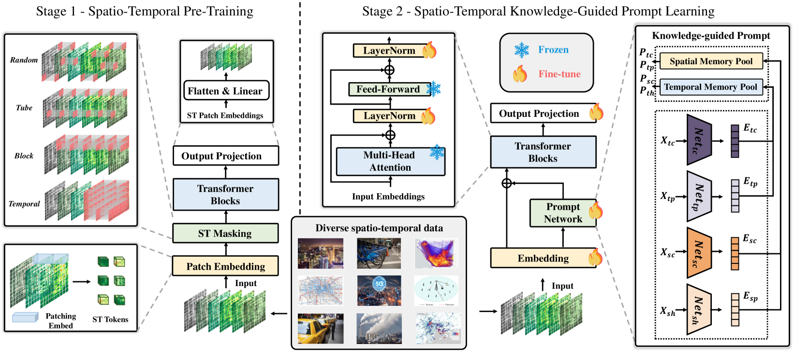
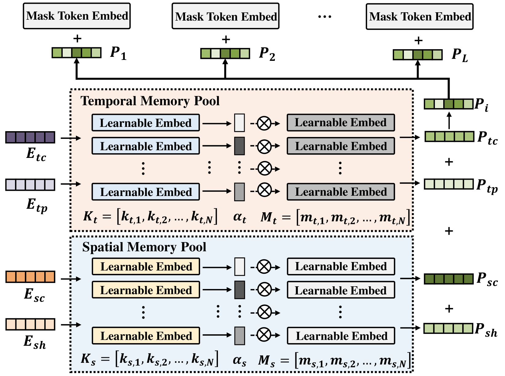



> 标题: [UniST: A Prompt-Empowered Universal Model for Urban Spatio-Temporal Prediction](https://arxiv.org/abs/2402.11838) \
> 作者: Yuan Yuan, Jingtao Ding, Jie Feng, Depeng Jin, Yong Li \
> 来源: SIGKDD 2024

## 简介

城市时空预测 (Urban Spatio-Temporal Prediction) 对于交通管理、资源优化和应急响应等智能城市应用至关重要 。传统的深度学习方法通常使用“一个任务，一个模型”的方法来解决问题，这种方法往往只能解决某一特殊领域的问题，训练得到的模型几乎没有泛化能力，难以应用于数据稀缺的场景。

受 NLP 和 CV 领域中基础模型 (Foundation Models) 的启发，本文建立了一个名为 **Unist** 的通用模型 (Universal Model)，这一模型具有强大的泛化能力，尤其可以解决城市时空预测中普遍存在的数据稀缺问题。

> TL;DR: 把 NLP 和 CV 那一套 Pre-training + Prompt Learning 用于城市时空预测。主要的创新点在于针对时空数据的特征构建了一套合适的 **Prompt Learning** 方法，也就是这个『**知识引导的动态提示生成**』。

下图展示了 Unist 的架构：Stage 1 负责大规模的时空数据预训练；Stage 2 负责时空知识引导的动态提示生成

## 方法

在深入模型细节之前，论文首先定义了一些基本概念

空间和时间划分 (Spatial and Temporal Partitions): 使用网格进行空间划分，把城市在 \(H \times W\) 大小的地图上以经纬度划分成相等且互不重叠的区域，以一定的时间间隔记录其动态。

时空数据 (Spatio-Temporal Data): 被定义为一个四维张量 \(T \times C \times H \times W\)，分别代表时间步、变量数、空间网格的高度和宽度。

时空预测 (Spatio-Temporal Prediction): 目标是学习一个映射函数 \(\mathcal{F}\): \(X_{[t:t+k]} = \mathcal{F}_\theta(X_{[t-l_h:t]})\)，根据过去 \(l_h\) 步的历史观测值 \(X[t−l_h:t]\) 来预测未来 k 步的状况 \(X[t:t+k]\)。\(\mathcal{F}\): \(X_{[t:t+k]} = \mathcal{F}_\theta(X_{[t-l_h:t]})\)

UniST 的核心方法论可以清晰地划分为基础模型设计、预训练阶段和提示学习阶段。

### Base Model

UniST 在这里选取的是基于 Transformer 的 encoder-decoder 架构。传统的 Tranformer 只能处理一维序列数据，UniST 在这里借鉴了 ViT的思想，做了一步时空分块 (Spatio-Temporal Patching) 的操作，通过一个 3D 卷积层把高维数据切分成一个个 patch，把他们展平成一个 1D 的序列。

传统的 Transformer 也不考虑序列的顺序。为了让模型能够理解序列的顺序，这里还引入了位置编码 (Positional Encoding) 分别应用于空间和时间维度，帮助模型理解时空数据中的顺序和位置关系。为了增强模型的泛化能力，这里使用正弦和余弦函数 (Sinusoidal Functions) 直接生成位置编码，而非使用可学习参数。

模型主体采用 MAE 思想的 Encoder-Decoder 框架。同时与主要用于特征提取的 MAE 不同，UniST 的 Decoder 与 Encoder 同等重要，在预训练和下游任务中都扮演着关键的重建和预测角色。

### Spatio-Temporal Self-Supervised Pre-train

预训练阶段的目标是通过自监督学习，让模型从海量、多样化的数据中掌握通用的时空动态规律。其核心是“掩码后重建”任务，作者在这里引入了四种 mask 的策略：
- 随机掩码 (Random masking): 随机屏蔽掉一部分时空 patch，强迫模型学习细粒度的时空关系。
- 管道掩码 (Tube masking): 屏蔽掉某个空间位置在所有时间步上的数据。模拟现实中某个传感器完全失效的场景，旨在提升模型的空间外推能力。
- 块掩码 (Block masking): 屏蔽掉一整个空间区域块的数据，这是一个更难的重建任务，旨在提升模型的空间迁移能力。
- 时间掩码 (Temporal masking): 屏蔽掉未来的所有数据，强迫模型仅根据历史信息进行预测，与下游的预测任务形式一致。

### Spatio-Temporal Knowledge-Guided Prompt

这是本文最核心的创新点。当预训练好的模型面对一个新任务（尤其是少样本或零样本场景）时，Prompt Learning 机制会启动，为模型生成 Prompt，引导其做出正确预测。

#### Spatial-Temporal Generalization

作者首先提出了一些假设，试图讨论为什么预训练模型可以用于未见过的场景：

1. 对于一个新数据集，总能从已见过的训练数据中找到与之相关的细粒度模式
2. 不同的时空模式应该对应不同的、定制化的 prompt
3. 存在一个可学习的函数，能够将时空模式映射到其对应的最佳 prompt

也就是说，针对不同时空模式的输入数据，我们希望自动生成定制化的 prompt

#### Spatio-Temporal Domain Knowledge

基于上述假设，模型首先要能理解当前输入数据的模式。作者利用了时空数据挖掘领域公认的四种领域知识，并设计了四个小型网络来分别提取这些知识的特征表示：
- 空间邻近性 (Spatial closeness): 临近区域相互影响。使用一个小的卷积核 (3x3) 的 CNN 来提取特征 `E_sc`
- 空间层级性 (Spatial hierarchy): 城市结构具有多层次性，需要对城市结构进行多级感知。使用多个不同尺寸的大卷积核 CNN 来提取多尺度的空间特征 `E_sh`
- 时间邻近性 (Temporal closeness): 近期数据影响未来的结果。使用一个注意力网络来聚合近期时间步的信息，提取特征 `E_tc`
- 时间周期性 (Temporal period): 数据具有日、周等周期性。选取过去几天同一时间点的数据，用另一个注意力网络来提取周期性特征 `E_tp`

下图示意了 prompt 生成的过程

#### Spatio-Temporal Prompt Learner

现在我们有了处理数据得到的各种属性表示，应该如何生成 prompt 呢？作者在这里没有使 CV 里常见的固定 prompt 方法，而是借鉴了 memory networks (Sukhbaatar et al., 2015) 的想法，设计了一种动态生成的机制。

模型创建了两个可学习的“知识库”──空间记忆池 (Spatial Memory Pool) 和 时间记忆池 (Temporal Memory Pool)。每个记忆池都由一系列的 (key, value) 对组成，这些键值对在训练中学习并存储了关于各种通用时空模式的知识。

查询与生成的步骤如下：
1. 将上一步提取的四份知识特征（如 `E_sc`）作为查询 (Query)。
2. 用这个 Query 去和记忆池中所有的 键 (Key) 进行相似度匹配。
3. 根据相似度得分，对记忆池中所有的 值 (Value) 进行加权求和。
4. 最终得到的这个加权和向量，就是为当前输入数据量身定制的、动态生成的提示 (Prompt)，如 `P_sc`, `P_sh`, `P_tc`, `P_tp`。

最后，这些生成的提示向量会被整合到 Transformer 的输入中，从而引导模型根据当前数据的特定模式进行精准预测。这个机制使得 UniST 能够灵活地适应各种未曾见过的数据分布，展现出强大的泛化能力。